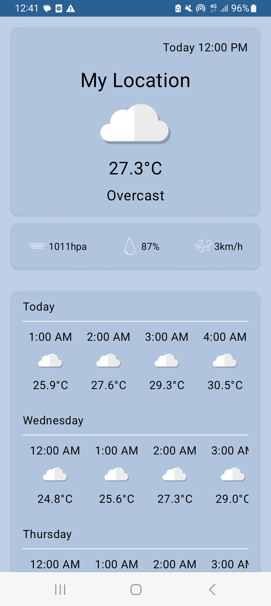
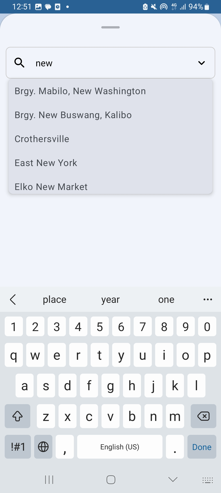
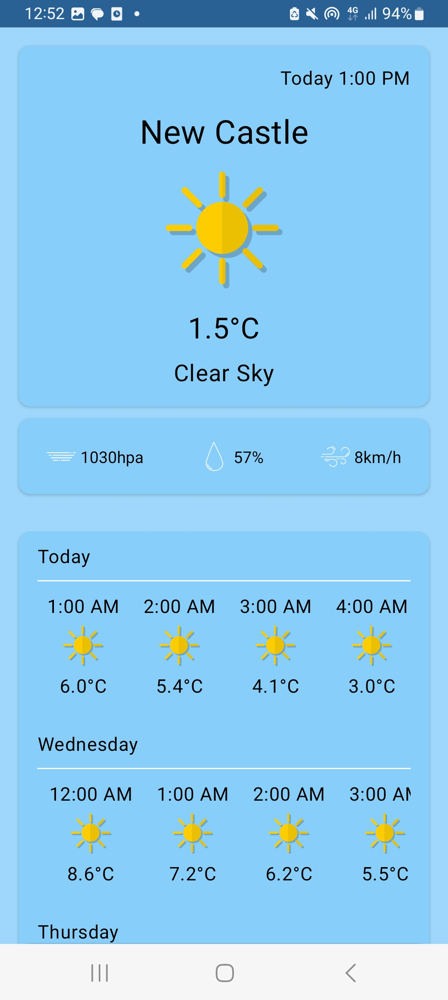

# EfficientWeather Android App
***
EfficientWeather is an Android application that provides weather information for the current location or a selected city based on its latitude and longitude. Users can choose a specific city, and the app will fetch and display the weather information for that location. Additionally, the app retrieves default weather information based on the user's current location.
 

## Features
* Display current weather information for the user's location
* Fetch and display weather information for a selected city
* Offline Supported
* Utilizes **`Room`** library for local database operations
* Network requests handled with **`Retrofit`**
* Threetenbp used for datetime operations
* Moshi employed as the JSON converter
* Dependency injection facilitated by **`Dagger Hilt`**
* UI designed using **`Jetpack Compose`**

## Project Structure
>The project follows a clean architecture with a multi-module design. Below are the key modules:

### `:app`
The presentation module responsible for the user interface and interaction. This module uses Jetpack Compose for building the UI.

### `:data`
Handles data operations and provides concrete implementations for business logic. This module integrates with the Room library for local database operations and Retrofit for network requests.

### `:domain`
Contains the business logic of the application. It defines the use cases and interacts with the data module.

### `:location`
A module specifically focused on providing location-related functionalities.

### `:designSystems`
This module establishes design guidelines for the application. It ensures a consistent and appealing user interface across the app.

## Libraries Used
* Room library
* Retrofit
* Threetenbp
* Moshi
* Dagger Hilt
* Jetpack Compose

 

### Screenshots

